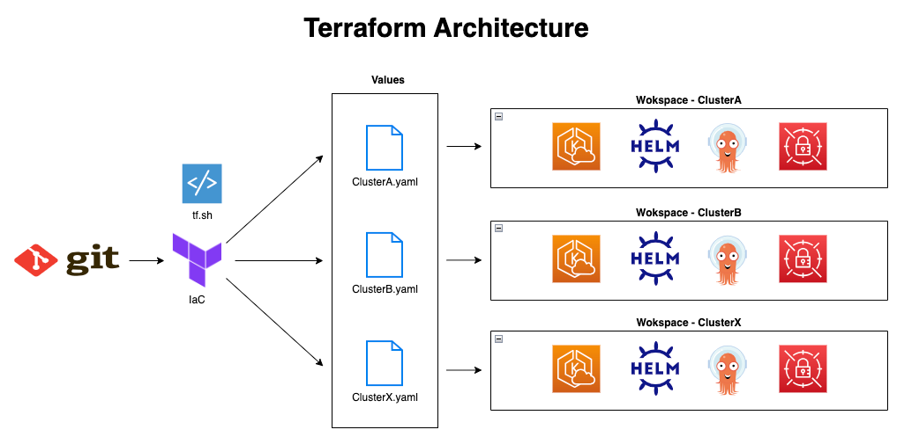
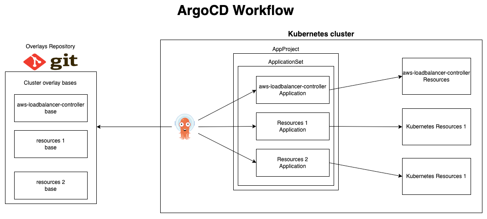
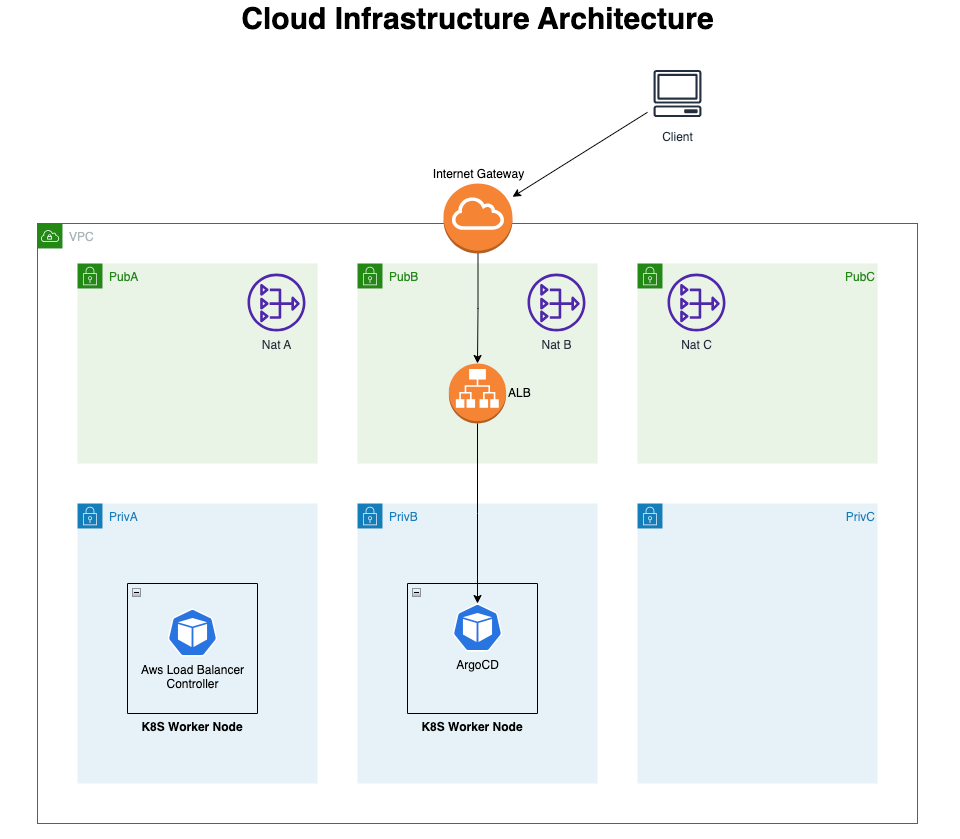
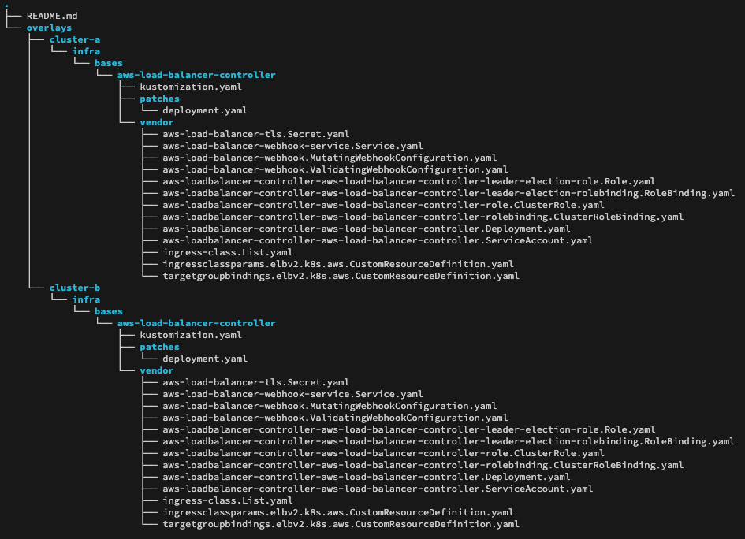
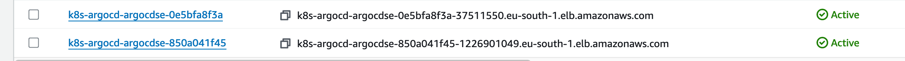
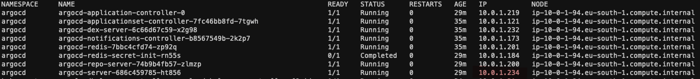
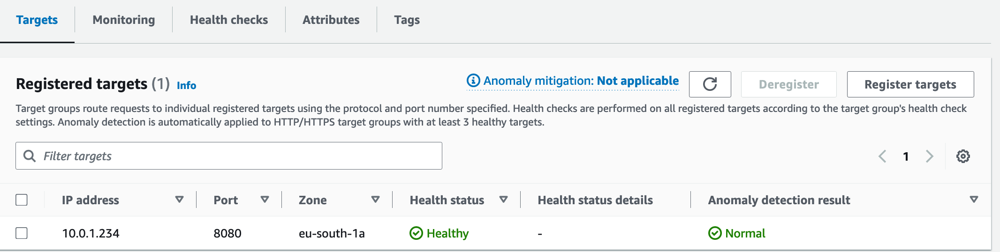
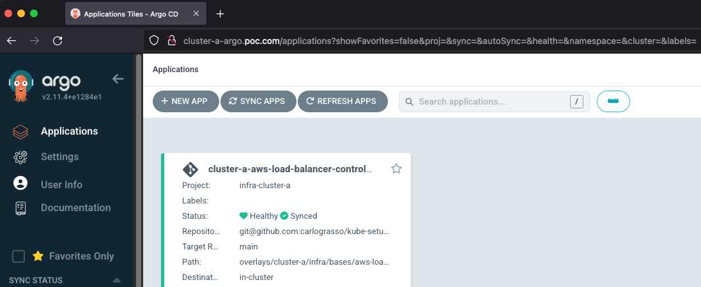
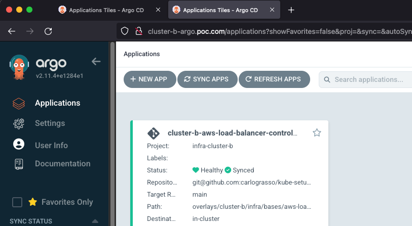

# Multi-cluster Kubernetes Setup with Terraform and Helm

## Introduction

This document outlines a Proof of Concept for setting up a multi-cluster Kubernetes environment using Terraform and Helm. The objective is to deploy Helm charts across multiple AWS EKS clusters and expose the services to the public internet, leveraging ArgoCD for continuous deployment.

# Audience
- Infrastructure team
- Risk Management Team
- Infrastructure and Operations Managers
- Chief Technology Officer (CTO)

# Scope

Define a Terraform setup that allows Helm chart deployment in a multi-cluster Kubernetes setup and to expose the services defined in those charts to the public internet.

Included Activities:

- Terraform setup.
- AWS EKS clusters deployment.
- ArgoCD Helm chart installation.
- Deploy infrastructure overlay with ArgoCD.
- Expose ArgoCD GUI to the public internet.

# Benefits
Implementing an automated approach to deploy and manage Kubernetes clusters using Infrastructure as Code (IaC) and the GitOps workflow offers several advantages:

- Reduced Provisioning Time and Effort: Automation significantly decreases the time and effort required by the infrastructure team to provision and configure new clusters.
- Minimized Risk of Human Error: Automated processes reduce the potential for errors caused by manual intervention, enhancing the reliability and consistency of the deployments.
- Increased Efficiency Across the Infrastructure Lifecycle: Automation streamlines the entire infrastructure lifecycle, from initial provisioning to ongoing maintenance and scaling, leading to greater operational efficiency.
- Enhanced Security: Automation and IaC ensure that security best practices are consistently applied, reducing the risk of misconfigurations and vulnerabilities.

## Assumptions and Prerequisites

- The project lives in the AWS Cloud
- Terraform CLI , kubectl, helm are installed.
- AWS cli is installed, and an AWS profile with proper permissions is configured (named “poc”).
- A VPC is provided with private and public subnets, the latter  should have the following tag:
    
    
    | Tag Key | Tag Value |
    | --- | --- |
    | kubernetes.io/role/elb | 1 |
- Overlay Repository Private Key stored in AWS Secrets Manager secret named “carlo/repo-key”  (forced naming convention).
- The overlay Repository already exists
- ArgoCD will be deployed in each cluster and will be used to deploy infrastructural resources.

## Expected Outcomes

- Successful deployment of multiple AWS EKS clusters.
- Installation of ArgoCD in each cluster.
- Deployment of Helm charts across the clusters.
- Public exposure of the services defined in the Helm charts.
- Accessible ArgoCD dashboards through the public internet.

# Architecture

---

To achieve the goal of managing multiple Kubernetes clusters and using the Helm Terraform provider to deploy resources, the proposal is to leverage Terraform workspaces, each Kubernetes cluster will have its own dedicated workspace, ensuring isolated environments for each cluster. This setup enables consistent deployment processes and configurations across all clusters with a single IaC codebase, with the flexibility to adjust variables specific to each cluster.



ArgoCD helm chart is deployed by helm terraform provider, aside with an ArgoCD AppProject and ApplicationSet that will reach another private repository, that contains all the clusters overlays, to deploy fundamental infrastructure components, like the **aws loadbalancer controller** need to expose to the public internet the ArgoCD dashboard.



Given the values provided during the ArgoCD helm chart deployment that specify internet-facing exposure, **the aws loadbalancer controller** will deploy an Application LoadBalancer in public subnets tagged in that way:

| Tag Key | Tag Value |
| --- | --- |
| kubernetes.io/role/elb | 1 |



## Terraform IaC Overview and  Repository Structure

---

For this PoC, the Terraform CLI is being used. It is recommended to implement at least a DynamoDB lock for the Terraform state when used beyond a PoC to ensure state consistency and prevent concurrent modifications.

The use of Terraform Cloud is highly recommended for managing workspaces efficiently. However, for this PoC, a simple `tf.sh` helper script is provided to facilitate workspace management.

The Terraform IaC code is hosted in the GitHub repository `carlograsso/tf-k8s-poc`.

```bash
.
├── backend.tf
├── clusters
│   ├── cluster-a.tfvars
│   └── cluster-b.tfvars
├── data.tf
├── kubernetes.tf
├── main.tf
├── misc
│   ├── AppProject.tpl
│   ├── ApplicationSet.tpl
│   ├── argocd-values.tpl
│   └── iam_policy.json
├── providers.tf
├── tf.sh
└── variables.tf
```

The repository follows a basic structure that includes backend and provider configurations along with variable definitions and some customisation.

- **main.tf**:
    - Defines the EKS Cluster.
    - Configures AWS Secrets to store the ArgoCD default password.
- **kubernetes.tf**:
    - Manages the ArgoCD Helm release.
    - Configures Kubernetes secrets to store the "overlay repo" private key, enabling ArgoCD to access it.
    - Defines the infrastructure ArgoCD AppProject and ApplicationSets, which will result in an application for each folder within the path `overlays/${var.cluster_name}/infra/bases/*` in the overlay repository.
- **clusters** directory:
    - Contains Terraform variable files for each cluster.
- **misc** directory:
    - Includes additional resources such as ArgoCD Helm chart values, an IAM policy required for the AWS Load Balancer Controller and ArgoCD AppProject and ApplicationSets template manifests.
- **tf.sh**:
    - A simple helper script that allows the execution of commands in the format `tf.sh TERRAFORM_ACTION CLUSTER`.
    - Automatically checks for the presence of the cluster’s variable file and creates/switches Terraform workspaces accordingly.

### [tf.sh](http://tf.sh) helper usage

```bash
❯ terraform workspace show
cluster-b
❯ terraform workspace list
  default
  cluster-a
* cluster-b

❯ ./tf.sh apply cluster-a
Workspace "cluster-a" already exists
Switched to workspace "cluster-a".
The workspace have been created, selected cluster-a
Operating on workspace cluster-a
module.eks.module.kms.data.aws_caller_identity.current[0]: Reading...
module.eks.data.aws_partition.current: Reading...
```

# ArgoCD Overview

ArgoCD is deployed using Terraform's Helm provider, with custom values to expose its dashboard via an "alb" ingressClass in plain HTTP, as we do not have certificates for this PoC.

A Kubernetes secret named "private-repo" is deployed in the ArgoCD namespace (by terraform, sourced from an AWS secret), containing the necessary keys and configuration to access the private overlay repository at [https://github.com/carlograsso/kube-setup](https://github.com/carlograsso/kube-setup). This repository contains the overlays for the clusters.

ArgoCD enables GitOps, facilitating the definition of Kubernetes resources as code and ensuring constant synchronization between the clusters and the repository.

Clusters overlay repository structure:



The approach involves building Helm charts and pushing them to the directory structure "clusterName/infra/bases/". These charts are managed using Kustomization, allowing for patching if specific adjustments are required per-cluster.

**In this example, there is considerable code duplication since Helm charts are built and copied into each cluster directory. In a production environment, it is advisable to store them in a separate repository, organized by release tags and accessed via Git reference.**

An ApplicationSet is deployed alongside the ArgoCD Helm chart. This setup results in the creation of an ArgoCD Application for each directory found under "ClusterName/infra/bases/".

# Networking Overview

The objective is to make the ArgoCD dashboard accessible from the public internet. To achieve this, a component capable of interfacing with our ArgoCD ingress is necessary. For this PoC, the **aws-loadbalancer-controller** fulfills this role.

The **AWS Load Balancer Controller** provisions an AWS Application Load Balancer configured with rules aligned to our ArgoCD ingress specifications, enabling the exposure of our service.

In our configuration, ArgoCD is set up to create a ClusterIP service, leveraging the **aws-loadbalancer-controller's** "target-type: ip" capability. This setup allows direct pod connectivity without additional hops on the host machine.

### AWS Load Balancers



### ArgoCD Pod IP



### Load Balancer target group



The Application Load Balancer (ALB) provided operates at Layer 7 and supports SSL/TLS termination, eliminating the need for managing certificates within the cluster. Additionally, it integrates seamlessly with AWS WAF application firewall.

In multi-cloud environments, alternatives such as the "nginx ingress controller" are available to avoid vendor lock-in, manage end-to-end TLS encryption, or meet specific requirements.

Since there are no certificates or DNS records configured for our exposed services, accessing the ArgoCD dashboard requires resolving the DNS name of the public ALB. The following entries should be added to "/etc/hosts" for proper access:

```bash
resolvedIpAddress        cluster-a-argocd.poc.com
resolvedIpAddress        cluster-b-argocd.poc.com
```





### Recommendations

- Terraform Cloud usage in oder to achieve a proper workspace and state management
- Do not expose internet facing ArgoCD dashboards.
- Use TLS certificates and DNS names in order to obtain proper connection encryption.